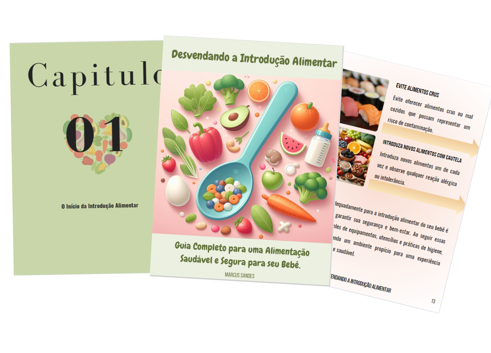

    

-------

# Projeto EBOOK Gerado por I.A.s

 > ℹ️ **NOTE:** Este é o repositório desenvolvido durante o curso no qual fui aluno na plataforma da [DIO](https://dio.me)

Projeto com o objetivo de gerar um ebook digital com as facilidades das ferramentas de IA. todos os prompts
seguem abaixo.

<a href="https://github.com/felipeAguiarCode/prompts-recipe-to-create-a-ebook/blob/main/output/ebook%20-%20css%20jedi%20output.pdf" title="View PDF now"> 📕Clique aqui para ler</a>

## 💻 Tecnologias utilizadas no projeto

- [ChatGPT](https://chat.openai.com/) 
- [Copilot](https://copilot.microsoft.com/)
- [Canva](https://www.canva.com/)

## 🧠 Prompts

ChatGPT：

|   Ação   | prompt                                                                                                                                                                                                                                                                         |
| :------: | ------------------------------------------------------------------------------------------------------------------------------------------------------------------------------------------------------------------------------------------------------------------------------ |
|  título  | crie um titulo de ebook épico e curto com o tema: "Introdução alimentar para bebês" onde o público alvo serão as mães                                                        |
| conteúdo | Crie capitulos simples e didatico sobre os temas: Dicas e Orientações Gerais,
Mitos e verdades sobre a introdução alimentar.
 |

Copilot：

|  Ação  | prompt                                                                                 |
| :----: | -------------------------------------------------------------------------------------- |
| título | Alimentos saudáveis em volta de uma colher em um fundo de cor suave. Deixa os alimentos em circulos |

## ✨ Features

- Conteúdo gerado via ChatGPT
- Imagens geradas via Copilot Microsoft
## 📚 Materiais

- Imagens utilizadas em `assets`
- ebook gerado durante as aulas em `output`

## 🛠️ Instruções de execução

Utilize os prompts acima nas ferramentas sugeridas para gerar o material base e utilize uma ferramenta de edição de documentos como power point, libreoffice , indesign para diagramação.

## 👨‍💻 Expert

    
    
&nbsp&nbsp&nbspMarcus Sandes 
    &nbsp&nbsp&nbsp
    <a href="https://github.com/marcussandes">
    GitHub</a>&nbsp;|&nbsp;
    <a href="https://www.linkedin.com/in/marcus-sandes/">LinkedIn</a>
&nbsp;|&nbsp;
    <a href="https://www.instagram.com/marksandes/">
    Instagram</a>
&nbsp;|&nbsp;

  

---

⌨️ com 💜 por [Marcus Sandes](https://github.com/marcussandes)
